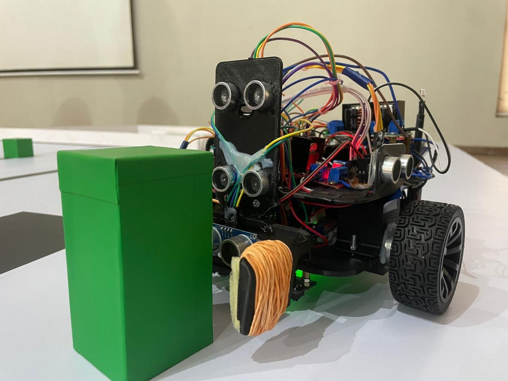

# 🤖 Autonomous Robot – Robot Design Module

This project features an autonomous mobile robot developed by **Team RoboCraft** for the **Hawkins Interdimensional Challenge 2024**, hosted by the Department of Electronic and Telecommunication Engineering, University of Moratuwa.

The robot was designed to complete a series of 8 challenging tasks involving line following, color tracking, box manipulation, portal navigation, and terrain traversal — all under fully autonomous control. Built using an Arduino Mega, JGA25 encoder motors, Reykha IR sensor array, and a 3D-printed chassis, the robot runs on an onboard 11.1V Li-ion battery and uses intelligent decision-making to adapt to each task without any external input.

---

## 🛠 Robot Overview

| Component           | Specification                               |
|---------------------|---------------------------------------------|
| **Microcontroller** | Arduino Mega 2560                           |
| **Motors**          | JGA25 DC Encoder Motors (×2)                |
| **Motor Driver**    | L298N Dual H-Bridge                          |
| **Gripper**         | SG90 Servo Motor                             |
| **Chassis**         | 3D Printed Body (240mm × 180mm footprint)   |
| **Sensors**         | Reykha Analog IR Line Sensor Array          |
| **Battery**         | 11.1V 400mAh Li-ion Battery (onboard power) |
| **Indicators**      | Onboard LEDs (task status and feedback)     |

---

## 🎯 Challenge Tasks

| Task No. | Task Name                         | Description                                                                 |
|----------|-----------------------------------|-----------------------------------------------------------------------------|
| **1**    | Line Width Detection              | Follow white lines of varying widths (3cm = 0, 6cm = 1) to extract a binary code |
| **2**    | Virtual Box Maze Navigation       | Simulate grabbing and transporting a virtual box with restricted movement     |
| **3**    | Color Line Following              | Follow Red or Blue line based on the checkpoint from Task 2                   |
| **4**    | Dashed Line Navigation            | Track a dashed white line leading to the portal area                          |
| **5**    | Portal Timing Challenge           | Time movement to pass through a 5s open/5s close gate without collision       |
| **6**    | Box Sorting                       | Arrange boxes of different heights in order (asc/desc based on prior path)   |
| **7**    | Box Insertion                     | Follow a line to insert a small box into a chamber hole                       |
| **8**    | Coin Drop on Magnetic Spot        | Drop a 2-rupee coin on an ‘X’ mark over uneven terrain to complete the run    |

---

## 🧩 SolidWorks Model Previews

The robot's mechanical structure was designed in **SolidWorks** to ensure precise fitting of components and smooth task execution. Below are some rendered previews from the CAD models.

| View                    | Preview                                      |
|-------------------------|----------------------------------------------|
| **Front View**       |       |
| **Rear View**       |     |
| **Top View**      |       |
| **Bottom View**      |       |
| **Gripper Design** |      |

> STL files and full CAD assemblies are available in the [`/STL files`](./STL files) folder.

